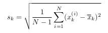
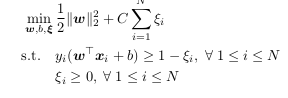

# SVMs-from-Scratch

Implementing SVMs on the Splice Dataset from UCI’s machine learning data repository.  The provided binary classification dataset has 60 input features, and the training and test sets contain 1,000 and 2,175
samples, respectively. The files containing features are called train data.txt and test data.txt, and the
files containing labels are called train label.txt and test label.txt.

# Data preprocessing

Preprocess the training and test data by

1. Computing the mean of each feature and subtracting it from all values of this feature.
2. Dividing each feature by its standard deviation, defined as

  

for feature k. This type of preprocessing is useful for SVMs, as SVMs attempt to maximize the distance between the
separating hyperplane and the support vectors. If one feature (i.e., one dimension in this space) has very
large values, it will dominate the other features when calculating this distance. Rescaling the features (e.g.
to [0, 1]), will ensure that they all have the same influence on the distance metric.

# Implementing a linear SVM

The input of train svm contains training feature vectors and labels, as well as the tradeoff parameter C.
The output of train svm contain the SVM parameters (weight vector and bias). 

  

To solve the above quadratic problem, I used the cvxopt.solvers.qp function in the
CVXOPT 4 Python package. For test svm, the input contains testing feature vectors and labels, as well as SVM parameters. The
output contains the test accuracy.
